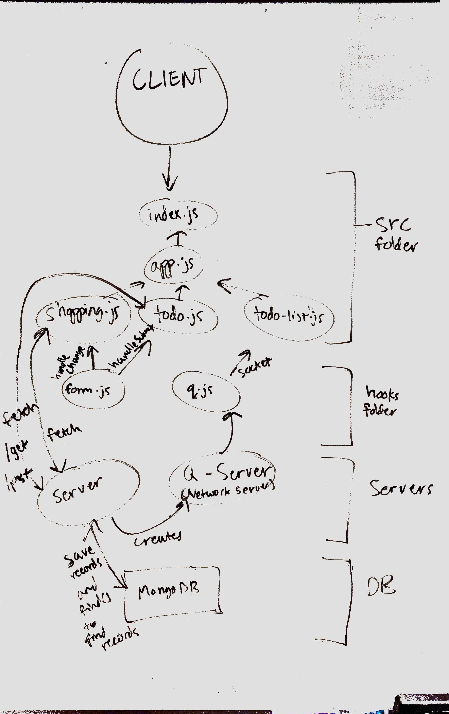

# LAB - 32

## React Todo APP Hooks

### Author: Jeremy Lee

### Links and Resources
* [submission PR](https://github.com/jeremy-401-advanced-javascript/Lab32/pull/2)
* [travis](http://xyz.com)
* [back-end](https://q-js401.herokuapp.com) (when applicable)
* [back-end](https://api-js401.herokuapp.com/api/v1/todo) (when applicable)
* [front-end](http://xyz.com) (when applicable)

### Modules
#### `modulename.js`
##### Exported Values and Methods

###### `foo(thing) -> string`
Usage Notes or examples

###### `bar(array) -> array`
Usage Notes or examples

#### Running the app
* `npm start`
* Endpoint: `/https://api-js401.herokuapp.com/api/v1/todo`
  * Returns a JSON object with todo items object inputted by the user.

#### UML

